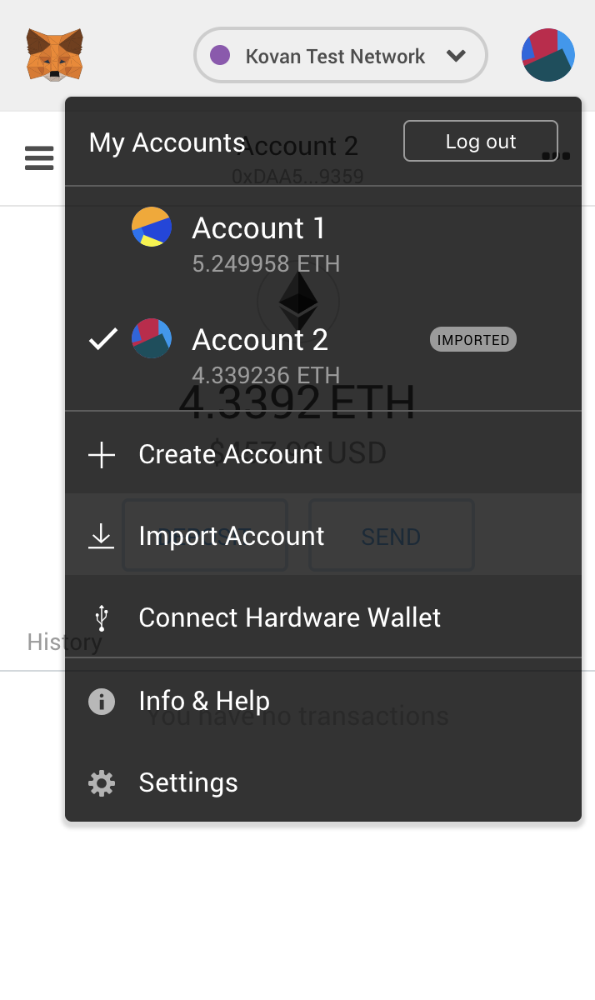

# Using H2O with the Kovan testnet

Ocean Protocol does not support using the official Kovan contracts deployed by the team as of yet. The instructions here are for deploying your own set of Keeper contracts.

This approach is not endorsed by Ocean Protocol and will be replaced once code for interacting with Ocean's contracts once they have written it.

Running on Kovan requires Parity.


## Create an Infura account

Create an Infura account at [infura.io](https://infura.io) and start a new project, calling it whatever you'd like.

Make a note of your PROJECT ID. This is referred to as 'INFURA TOKEN' in the Ocean Protocol code.

Go to [iancoleman.io](https://iancoleman.io/bip39/#english) and generate a BIP39 mnemonic. Use the default 15-word setting and hit 'GENERATE.'

Make a note of this mnemonic.

*Your mnemonic must remain private at all times, should never be hard-coded and should never be commited to Git. If you use your mnemonic in any way in code, it should be passed as an environment variable.*

Note your mnemonic is refferred to as 'KOVAN_NMEMORIC' \[sic\] in the Ocean Protocol code. In terms of endpoints, V2 is used by Ocean but V2 and V3 can be used interchangeably with H2O. 


## Create your publisher account

Your publisher account is the address from which the Keeper contracts will be deployed and publishing contracts will be generated.

To get this account, set your environment variables:
```
export INFURA_TOKEN = [YOUR_PROJECT_ID]
export KOVAN_NMEMORIC = [YOUR_MNEMONIC_WRAPPED_IN_QUOTES]
```

Run the `get_publisher` script:
```
chmod +x get_publisher
./get_publisher
```
The script will output your publisher account address and private key, as well as generate a JSON keystore file in the `H2O/kovan` folder.

You can import this account into a wallet of your choosing, e.g. MetaMask.



This address is deterministically generated according to your Infura project ID and mnemonic. It is independent of the machine you are using. If you lose the address you can just run the script again and get it back as long as you still have your project ID and mnemonic. Any ETH you've transferred to the address will stay with it. This illustrates one of the many truly practical properties of blockchain.


## Getting Kovan ETH

In order to deploy your contracts, you'll need about 0.2ETH. You'll need additional ETH for the contracts deployed when publishing assets.

You can get Kovan Ether at these locations:
- [Gitter Faucet](https://gitter.im/kovan-testnet/faucet) – 3ETH
- [GitHub Faucet](https://faucet.kovan.network/) – 1ETH

These have a timeout so you'll have to wait before repeat faucet use.

Once you've transferred some ETH to your provider address you can continue. If the account ever runs out of ETH, you can top up using the steps above.


## Deploying contracts to Kovan

```
./deploy_contracts
```
Options (`./deploy_contracts [OPTION]`):
- Default (no option): v0.5. Trilobite (verified working)
- `plankton`: v0.4 Plankton (verified working)
- `latest`: latest set of Keeper contracts from Ocean Protocol.

The script will display a URL of your deployed contracts on Etherscan when finished.


## Launching a Kovan Parity node

```
./start_parity
```
Squid will now point to your Parity node as the Keeper.

From here, you have two options: running with Keeper only, for which just comment the Aquarius URL in your `config_local.ini` file, and running normally, which means starting an Aquarius instance. You can `git clone` Aquarius from [here](https://github.com/oceanprotocol/aquarius).